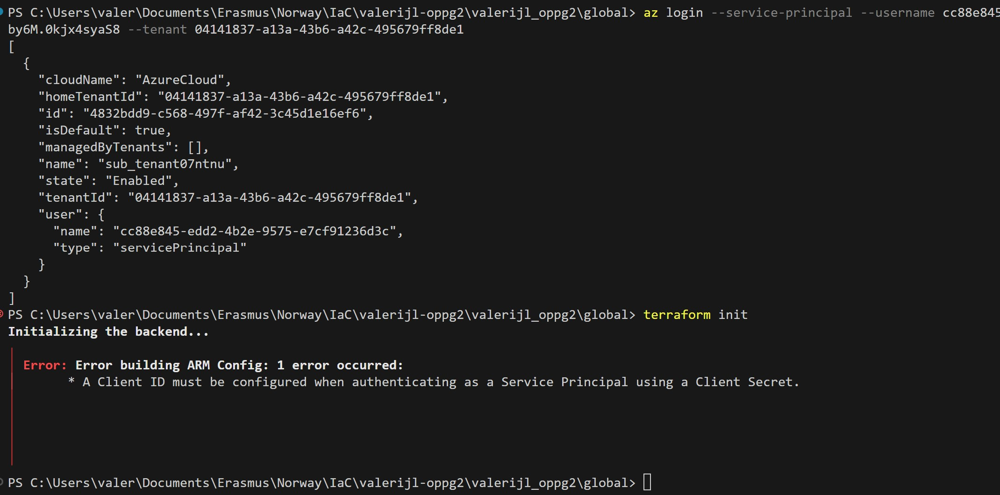

1. backend contains the code that created the storage account for tfstate holding.

2. modules contains folders for different module creation (modules get called from deployment)

3. global contains variables that are shared accross the whole infrastructure

4. deployments contains code that initializes the required modules with generated values

5. https://github.com/Nego-glitch/valerijl_oppg2.git is the repository of the created project with branches:
    - main
    - dev
    - prod
    - staging

    If the repo is available, then it has code for workspace creation/selection based on which branch the user is. I am unsure how the repo connection would work, but I shall kepp the repo up until the end of semester.

6. When using this code, first happens az login. Then use cd backend.

7. Then for backend creation the backend "azurerm" {...} needs to be commented, after that initialization, planning and application. After this get the storage account name, insert into backend, uncomment backend, save and once again init, plan, apply. After this use cd ..\, then cd global.

8. After this, also add the sa_name to global\providers.tf, deployments\main.tf and deployments\providers.tf.

9. Then run init, plan and apply in global. After this is done, once again, cd ..\ and then cd deployments.

10. Now follow the same steps for this folder too to initialize terraform. This should create the very base of the project.

11. After all this, if code is pushed or pull_request is sent if user is on dev/staging it should auto apply (if checks pass), if user is on main/prod it should check if the necessary secret exists/is correct.

EDIT: It seems that there might have been an app fail or something similar as it no longer recognizes credentials. This also keeps happening after new app creation:  Due to this I wasn'table to test the new creation code (The 1st one worked and deployed properly and the pipeline launched).

Folder structures:

- Implimentation-vise Alternative Two is the most easy to follow and create, but for more easy flexibility (in my opinion), but overall Alternative One is the best one for use.

Reasons:

- It is easily scalable for each enviroment, with seperate values and code, which makes it easy to add more envireoments and components in each.
- It is rather demanding on maintainability as each enviroment can be managed completely independently.
- Separation of concerns also works well as they are completely distinct for each enviroment.
- If following the videos, it seemed easier to implement Alternative Two, but if considering overall issues, then Alternative One might be easier as it doesn't need a shared pipeline, but can use different ones.